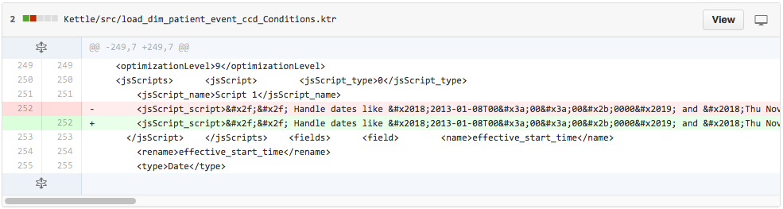
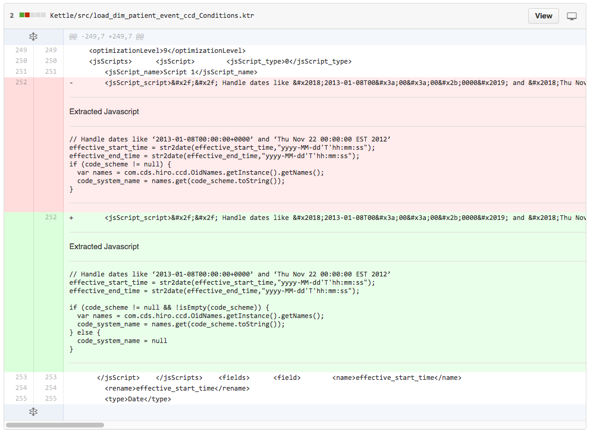

= Pentaho JS Viewer

Makes it possible to view javascript transforms from Pentaho in Github

https://chrome.google.com/webstore/detail/pentaho-js-viewer-for-git/nliflknpgcpicoedmcpbgonlpekjdmpl[Chrome Store]

=== Before

=== After

=== Building Locally

[source,bash]
----
npm install
bower install
gulp build
----

=== If you want to continuously develop

[source,bash]
----
gulp watch
----

=== Packaging

[source,bash]
----
gulp package
----
